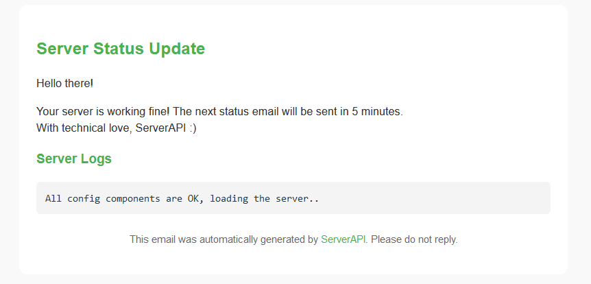

# ServerAPI

ServerAPI is a versatile software that allows you to turn any machine (Windows, Linux, and macOS) into a server. It sends machine statistics via email (configurable via setup wizard), display and register logs.

## Technologies

This project uses [`lettre`](https://lettre.rs/) crate to send e-mails, async-std to execute code in async/await and [`valence`](https://valence.rs/) to add minecraft server software that runs in async with the mail server (removed). Everything is written in the **Rust** programming language (except the sent mail which is written in html & css, see the [`showcase`](https://github.com/heydocode/ServerAPI/tree/master/README.md#Showcase) section).

## IMPORTANT

ServerAPI has 1 single **stable** release which is 1.0.0, please install the release [`here`](https://github.com/heydocode/ServerAPI/releases/tag/1.0.0)

This project isn't meant for production use, it doesn't even support encryption!

## Features

- Easy installation and setup
- Sends machine statistics via email
- Supports running a Minecraft server with monitoring

## Requirements

- Access to Wi-Fi
- A compatible device (only Desktop devices are supported)

## Installation

1. Download and install the executable file.
2. Launch the software.
3. Follow the setup wizard.
4. Enjoy using ServerAPI!

## Configuration

ServerAPI includes a setup wizard that guides the user through the necessary configuration steps. The user simply needs to answer the wizard's questions and confirm the provided information.

## Showcase

## Support

For support, please create an "issue" on the GitHub page of the software.

## Contributing

We welcome contributions! If you would like to contribute, please fork the repository and create a pull request. We are open to any suggestions for improvement.

## License

This project is open-source and available under the MIT license. You are free to use, modify, and distribute the code as needed.

## Acknowledgments

Special thanks to the Rust programming language community and the creators of the "lettre" Rust crate for making this project possible.
